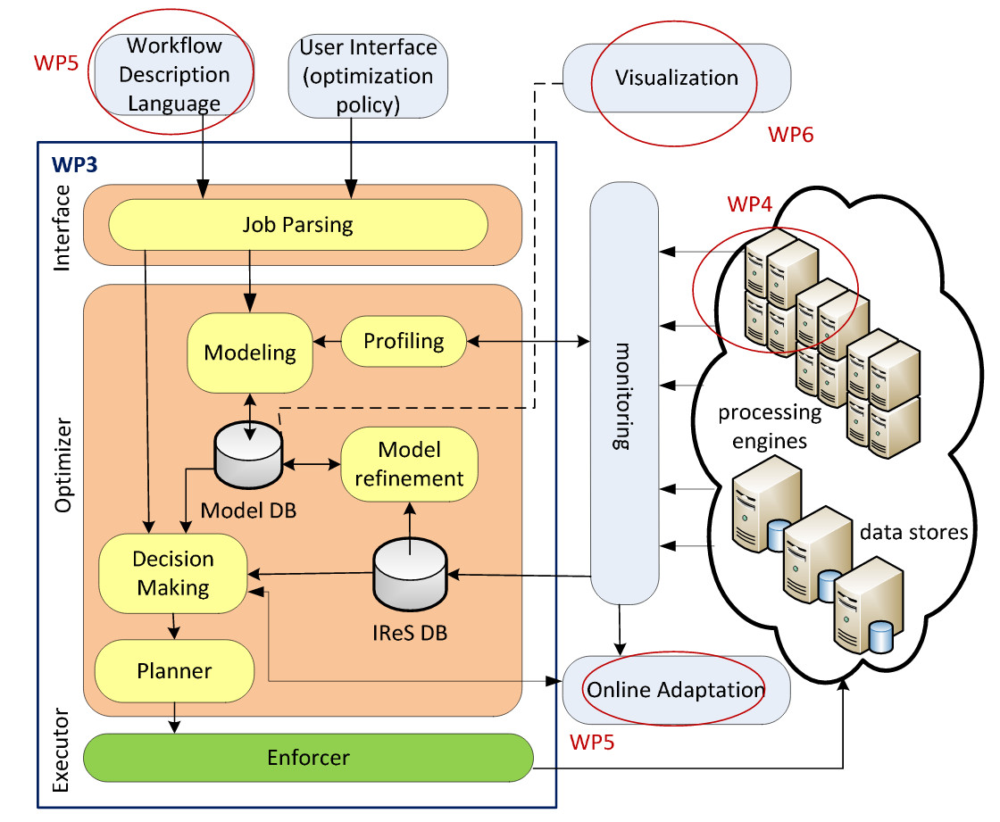
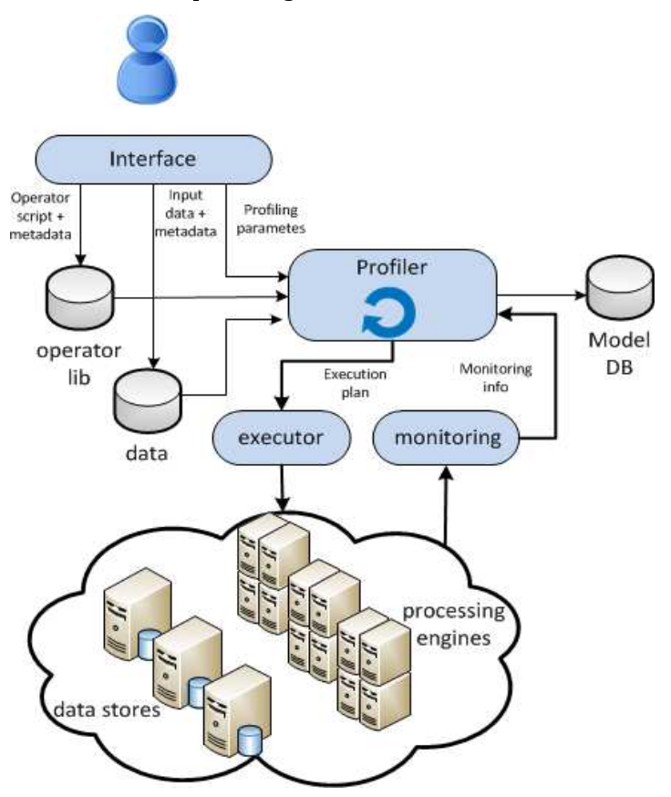
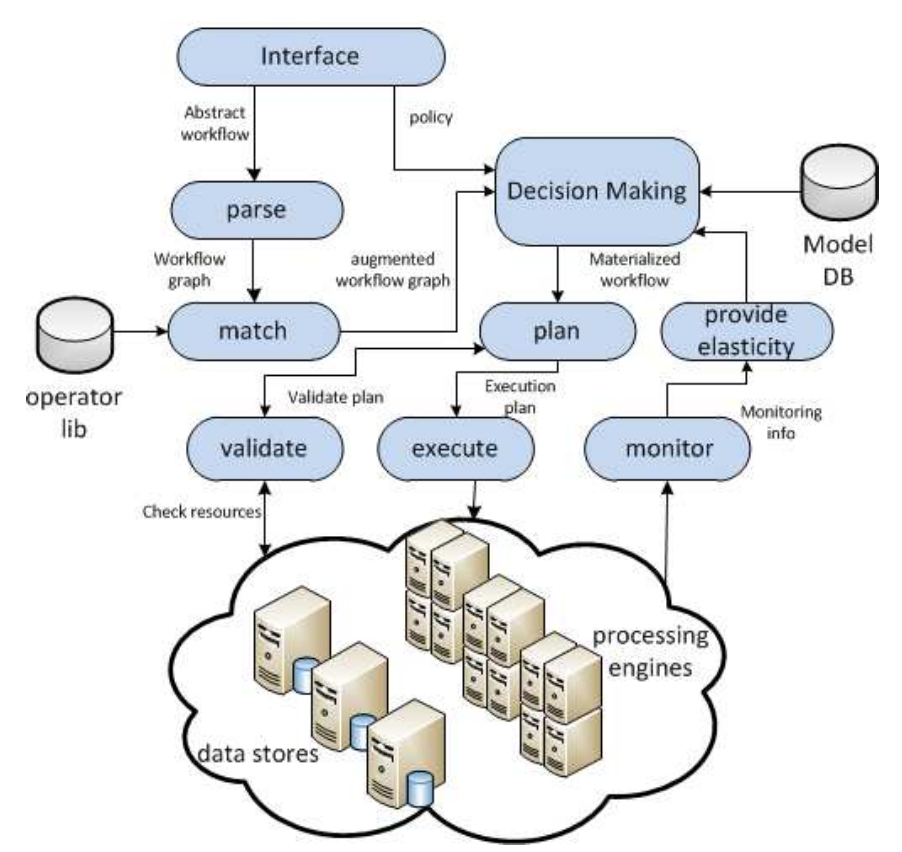

.. highlight:: rst

############
Architecture
############
This  section  describes  the  IReS  architecture.  Moreover,  the  way  external  components  of  the  ASAP  system communicate with IReS is specified through a well-defined API.

====================
General Architecture 
====================
Figure 1 depicts the final architecture of the IReS platform as well as its interaction with external components, being developed in WP 4, 5 and 6. IReS comprises of three layers, the interface, the optimizer and the executor layer. The interface layer is responsible for communicating with the application UI in order to receive  the  input  that  is  necessary  for  its  operations.  It  consists  of  the job  parser module, which identifies execution artifacts such as operators, data, their dependencies and  accompanying  metadata.  Moreover,  it  validates  the  user-defined  policy.  All  this information must be robustly identified, structured in a dependency graph and stored. The optimizer layer is responsible for optimizing the execution of an analytics workflow with respect to the policy provided by the user. The core component of the optimizer is the **Decision Making** module, which determines the best execution plan in real-time. This  entails  deciding  on  where  each  subtask  is  to  be  run,  under  what  amount  of resources  provisioned,  the  plan  for  moving  data  to/from  their  current  locations  and between runtimes (if more than one is chosen) and defining the output destinations. Such a decision must rely on the characteristics of the analytics task in hand and the models of all possible engines. These models are produced by the Modeling module and stored  in  a  database  called **Model  DB**.  The  initial  model  of  an  engine  results  from profiling  and  benchmarking  operations  in  an  offline  manner,  through  the **Profiling Module**.  This  module  directly  interacts  with  the  pool  of  physical  resources  and  the monitoring layer in-between. While the workflow is being executed, the initial models are refined in an online manner by the Model refinement module, using monitoring information of the actual run. Such monitoring information is kept in the **IReS DB** and is utilized  by  the  decision  making  module  as  well,  to enable  real-time,  dynamic adjustments of the execution plan based on the most up-to-date knowledge. 

The *executor  layer*  is  the  layer  that  enforces  the  selected  plan  over the  physical infrastructure.  It  includes  methods  and  tools  that translate  high  level  “start  runtime under  x  amount  of  resources”,  “move  data  from  site Y  to  Z”  type  of  commands  to  a workflow  of  primitives  as  understood  by  the  specific  runtimes  and  storage  engines. Moreover,  it  is  responsible  for  ensuring  fault  tolerance  and  robustness  through  real-time monitoring. 

The following  chapter  elaborates  on  the  internals  of  each  module  as  well  as  on implementation decisions and initial evaluation.

   IReS Architecture

=========
Workflows
=========
The main functionality of the IReS platform is covered by two workflows, the Profiling and the Planning and Execution workflows. 

Profiling Workflow 
------------------
This workflow, depicted in Figure 2, describes the process that takes place whenever a new materialized operator, accompanied by its metadata description, is added to the operator library of the IReS platform. This operator insertion triggers an offline profiling process to obtain knowledge about its behavior under different configurations. 

During profiling, a number of different operator configurations are adaptively selected by the profiler. The operator is then executed under these different setups and a number of  metrics  (currently  45)  are  monitored  in  order  to  train  and  create  accurate performance models. These metrics include: (a) execution time, (b) all the monitoring metrics reported by the ganglia2 monitoring tool (e.g., CPU, RAM, iops, network traffic etc.), (c) operator specific metrics (e.g., number of results, output size, etc.). Moreover, the developer can provide her own monitoring probes through a well-defined API. These models populate a knowledge base, Model DB, that can be used to facilitate the decision making process. Profiling is an iterative process, with configurations being selected dynamically, based on the accuracy of the model with respect to the so far collected measures. More details about the implementation of the profiling module follow in section 3.2. Figure 2 Profiling Workflow

   Profiling Workflow

Planning and Execution Workflow
-------------------------------
This workflow (see Figure 3) takes place when a new workflow along with the desired optimization policy is provided for execution by the user. This policy can consist of one or a function of multiple operator performance metrics like cost, execution time, etc.  

The  Decision  Making  module  matches  the  operators  present  in  the  user-provided workflow with the actual implementations of them residing in the platform's operator library and explores the possible alternatives in order to find the plan that best matches the user-defined policy. 

When this plan is located, it is first validated against the current resources and their load and then executed by the Enforcer module. If necessary, IReS falls back to the execution of another plan (e.g., when the Enforcer detects that the actual plan execution deviates largely from its expected behavior). Lastly, IReS manages the elasticity of the underlying infrastructure by monitoring the utilization  of  the  engine  resources.  Based  on  this monitoring  information  it  can  take decisions for allocating and de-allocating computing resources in order to improve the general execution of workflows and operators.

   Planning and Execution Workflow

============
External API
============
External API The functionality of the IReS platform is exposed to the rest of the ASAP components through a RESTful API. The intra-IReS API, through which the various modules of the IReS architecture communicate and interact, is presented in the following chapter. The RESTful API can be accessed in `this link <./rest_api>`_

