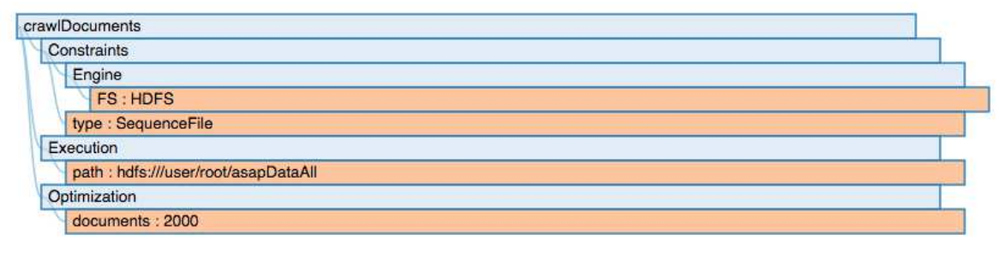
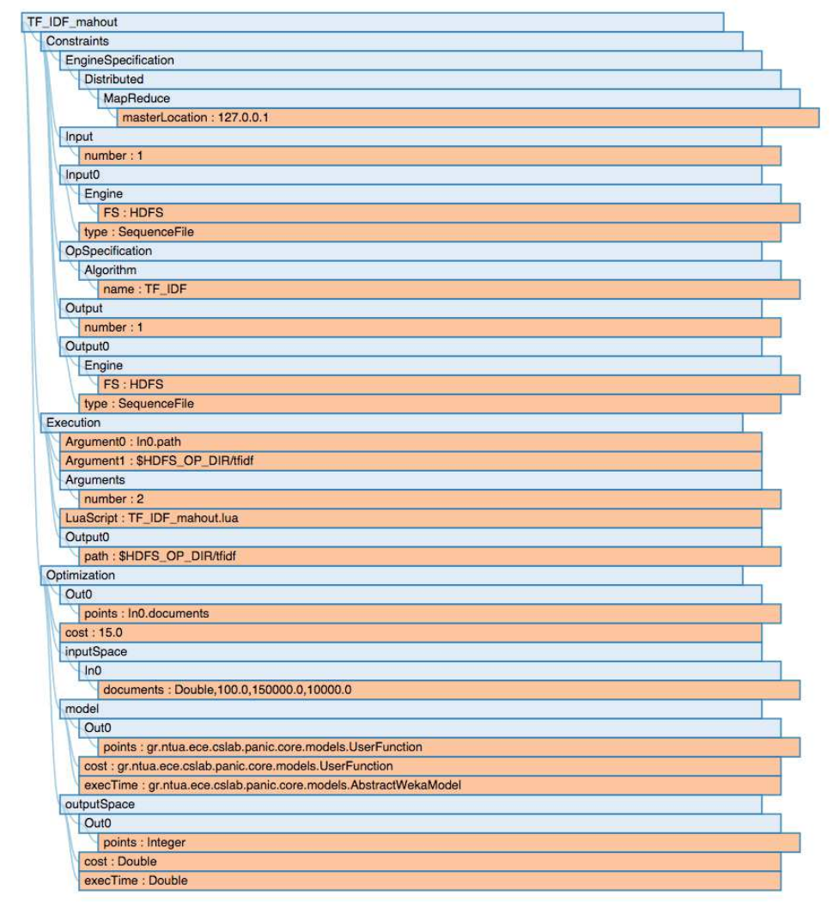
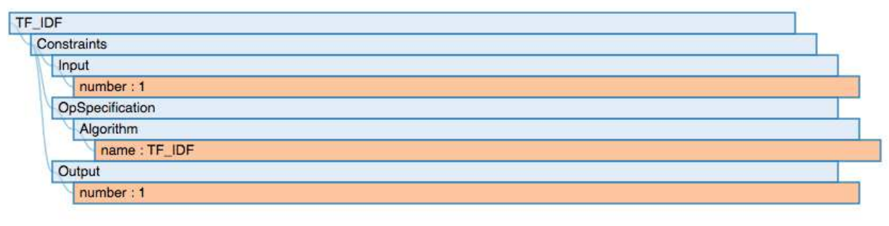

#############################################
Workflow and Operator Definition
#############################################

In this section, we describe in detail the current implementation of the IReS platform [7] . We discuss the functionalities provided by the different modules of the platform as well as the intuition behind the architectural and algorithmic decisions made. The code of the IReS platform is open  source and can be found in https://github.com/project-asap/IReS-Platform. 

===================
Job Parsing Module 
===================

This module is responsible for handling the interaction between the users and the IReS platform. A user should be able to define operators, datasets, workflows, etc. along with their  properties  and  restrictions  using  a  common  description  framework.  The  **Job parsing** module is thus responsible for both  defining this description framework and being able to parse and utilize the user provided input.  The main challenges of defining such a metadata description framework are:

* **User extensibility** : Users should be able to define and add their own metadata for operators and datasets. User defined metadata can be used for fine-grained operator  description.  Using  a  predefined  set  of  metadata  could  hinder  the extensibility of the platform for supporting new engines and operators.
* **Abstraction** : The  IReS  platform  targets  the  optimization  of  multi-engine workflows,  examining  alternative  execution  paths  of  the  same  conceptual workflow, using various underlying engine and operator implementations. To be able to describe such scenarios, the user should be able to specify the data and operators that compose her workflow in a way as abstract as she desires. The IReS planner and workflow scheduler need to remove that abstraction, find all the alternative ways of materializing the workflow and select the most beneficial, according to the user-defined policy.  

=========================
Tree-metadata framework 
=========================

Our proposed metadata framework describes data and operators. Data and operators can be either abstract or materialized. Abstract are the operators and datasets that are described partially or at a high level by the user when composing her workflow whereas materialized  are  the  actual  operator  implementations  and  existing  datasets,  either provided by the user or residing in a repository. Both data and operators need to be accompanied by a set of metadata, i.e., properties that  describe  them.  Such  properties  include  input  data  types  and  parameters  of operators,  location  of  data  objects  or  operator  invocation  scripts,  data  schemata, implementation details, engines etc. The provided metadata can be used to:  

a. Match abstract operators to materialized ones

b. Check the usability of a dataset as input for an operator. If the dataset does not match the operator’s input, its metadata can be also used to check for appropriate transform/move operators that can be applied.

c. Provide  optimization  parameters  like  the  profiling input/output  space  (the parameters to take into account and the metrics to measure respectively) or user provided  profile  functions.  This  information  is  based  on  our  black  box  operator profiling approach.

d. Provide  execution  parameters  like  the  path  of  a  file  in  the  filesystem  or arguments for the execution of the operator script.To  provide  such  a  user  extensible  metadata  framework  we  opt  for  a  generic  tree metadata format. To avoid restricting the user and allow for extensibility, the first levels of the metadata tree are predefined but users can add their ad-hoc subtrees to define their custom data or operators. Moreover, some fields (mostly the ones related to the operator and data requirements) are compulsory while the rest are optional and user defined. Materialized data and operators need to have all their compulsory fields filled in with information. Abstract data and operators do not adhere to this rule. In general we define the following predefined parts of the meta-data tree

------------
Constraints 
------------

This sub-tree contains all the meta-data information that is used to match abstract and materialized operators and datasets. The information contained in this sub-tree should contain  input/output  specification  for  operators,  algorithm,  engine  specification  and whatever  else  the  user  considers  that  should  take  part  in  the  abstract/materialized matching of operators. The predefined, compulsory fields of the operator metadata are primarily the number of its inputs and outputs: 

| Constraints.Input.number=<number of inputs>
| Constraints.Output.number=<number of outputs> 

In the above description, the metadata were presented with a key-value representation were the key denotes the path from the root node of the tree to the specified metadata leaf. For each defined input and output the respective specification metadata should be put in the following subtrees:  

| Constraints.Input{id} 
| Constraints.Output{id} 

The respective metadata subtrees are automatically matched with the existing datasets in order to check for usability or move/transform operators that should be applied. The respective  output  metadata  specifications  are  also copied  to  the  metadata  of  the intermediate output workflow datasets in order to enforce data constraints along the workflow.

----------
Execution 
----------

This subtree contains all the information required for the execution of a materialized operator.  Our execution engine utilizes YARN in order  to  execute  a  DAG  graph  of  operators.  Execution  specific  metadata  like  dataset 
paths or details about staging in/out files from containers that use their local file system are provided here.  This subtree has the following predefined metadata for datasets:

Execution.path=<the path of the dataset> 

For operators we have the following metadata: 

| Execution.LuaScript=<Lua script of the operator> 
| Execution.Arguments.number=<number of arguments of the execution script> 
| Execution.Argument{id}=<value of the specific argument>
| Execution.Output{id}.path=<the path of the specific output dataset> 
| Execution.copyToLocal=<list  of  files  that  need  to  be  copied  in  the  container  before  the execution of the operator> 
| Execution.copyFromLocal=<list of files that need to be maintained after the execution of the operator> 

The  use  of  those  metadata  is  further  described  in  the Enforcer section. In  general,  these  metadata  give  information  about  the location of execution script for the operator as well as for its arguments. We also give information  about  stage  in  and  stage  out  files  that  are  required  by  the  distributed execution of operators using YARN containers. 

------------
Optimization
------------ 

This part of the metadata gives information required by the profiler module. They are used  to  effectively  estimate  the  execution  metrics of  operators  and  utilize  them  to generate execution plans for workflows.  

| Optimization.inputSpace.{metric name}=<type> 
| Optimization.outputSpace.{metric name}=<type> 
| Optimization.model.{metric name}=<UserFunction or Profile> 

As can be seen from the above metadata, users are able to define the input/output profiling space for each materialized operator. For each of the output  metrics  the  user  is  able  to  either  provide  a  user  defined  function,  used  for estimation, or state to the system that the metric should be estimated using a profiling procedure.  In the following sections, we give some concrete examples for the metadata of datasets and  operators.  For  better  understanding  we  give  both  a  visual  representation  of  the metadata  tree  as  can  be  seen  from  the  platform’s  web  interface  and  also  the  actual metadata in key-values where the key denotes the path of the specific metadata node. 

-----------------------------
Dataset metadata description 
-----------------------------
In this section, we give an example of a dataset description (Figure 4).

| Optimization.documents=2000 
| Constraints.Engine.FS=HDFS  
| Constraints.type=SequenceFile 
| Execution.path=hdfs:///user/root/asapDataAll 

	
	Dataset Metadata

------------------------------
Operator metadata description 
------------------------------
In this section, we give an example of a materialized operator description (Figure 5). 

| Constraints.Input.number=1 
| Constraints.Output.number=1 
| Constraints.Input0.Engine.FS=HDFS  
| Constraints.Input0.type=SequenceFile  
| Constraints.Output0.Engine.FS=HDFS 
| Constraints.Output0.type=SequenceFile 
| Constraints.OpSpecification.Algorithm.name=TF_IDF  
| Constraints.EngineSpecification.Distributed.MapReduce.masterLocation=127.0.0.1 
| Optimization.inputSpace.In0.documents=Double,100.0,150000.0,10000.0 
| Optimization.outputSpace.execTime=Double 
| Optimization.outputSpace.Out0.points=Integer 
| Optimization.outputSpace.cost=Double 
| Optimization.model.execTime=gr.ntua.ece.cslab.panic.core.models.AbstractWekaModel 
| Optimization.model.Out0.points=gr.ntua.ece.cslab.panic.core.models.UserFunction  
| Optimization.Out0.points=In0.documents  
| Optimization.model.cost=gr.ntua.ece.cslab.panic.core.models.UserFunction 
| Optimization.cost=15.0 Execution.LuaScript=TF_IDF_mahout.lua Execution.Arguments.number=2 
| Execution.Argument0=In0.path Execution.Argument1=$HDFS_OP_DIR/tfidf 
| Execution.Output0.path=$HDFS_OP_DIR/tfidf 

	
	Materialized Operator Description

-----------------------
Tree-metadata matching 
-----------------------

Apart from materialized operators and datasets the user of the IReS platform can define abstract operators and datasets that are used for creating abstract workflows and can be matched with the existing materialized ones in order to find all possible execution plans. Abstract operators are described using the same tree metadata framework, described in the  previous  sections.  The  main  difference  is  that abstract  operators  can  have  less metadata  attributes  than  the  materialized  ones.  We also  allow  users  to  add  regular expressions in the abstract operator metadata. This is done in order for IReS platform to be able to support more generic matching. For example the * symbol under a field means that the abstract operator can match materialized ones with any value in that field. The matching procedure checks if all the metadata of the abstract operator are present in (match if they are regular expressions) the materialized operator. To make this check efficient,  the  metadata  trees  are  stored  in  main  memory  tree  structures.  The  tree structure used store all children of a metadata node in a sorted list according to their name. Thus, if both metadata trees are stored with ordering we can perform a merge check of both trees in order to find if the operators match. This procedure iterates over the sorted metadata and tries to match the abstract with the materialized ones. To check the  matching  of  two  operators  we  require,  in  worst case,  only  one  pass  over  the metadata  of  both  operators.  Thus,  the  matching  process  is  linear  to  the  size  of  the metadata trees and can be used very efficiently. 

.. _abstract_op_desc
------------------------------
Abstract operator description 
------------------------------
In this section, we give an example of an abstract operator description (Figure 6). 

Abstract operator metadata 

| Constraints.Output.number=1 
| Constraints.Input.number=1 
| Constraints.OpSpecification.Algorithm.name=TF_IDF 

As  we  can  see,  the  abstract  operator  contains  metadata  only  under  the  constraints subtree because only those are used for the matching procedure. It mainly targets the matching of the algorithmic operation of the operators as well as the matching of inputs and  outputs  used.  This  operator  matches  with  the  materialized  TF_IDF  operator presented in the previous section.

	
	Abstract Operator Description

------------------------------
Abstract workflow description 
------------------------------
In this section, we present the description of an abstract workflow. The user of the IReS platform has the ability to describe a workflow in an abstract way and the let the system find all possible matches for the operators and generate the materialized workflow that contains  all  the  possible  alternative  execution  plans.  An  abstract  workflow  can  be created  using  both  materialized  and  abstract  datasets  and  operators.  Materialized datasets are used to define the already existing input datasets of the workflow. Abstract datasets  can  be  used  for  defining  the  intermediate results  that  are  created  after  the execution of a specific operator. These abstract datasets will get concrete specifications from the materialized operator’s output specifications when the materialized workflow is generated. Concerning operators, the user can create her workflow using materialized operators that exist in the operator library or abstract operators that match with several of the existing materialized operators. An example of an abstract workflow is depicted in Figure 7. 

An abstract workflow is defined as a DAG graph that connects a mixture of abstract and materialized datasets and operators. The missing information needed for describing the DAG graph is a set of edges. For example the description of the previous workflow can be created using the following list of edges (d1 is the output of TF_IDF and d2 is the output of k-Means). 

| crawlDocuments,TF_IDF 
| TF_IDF,d1 
| d1,k-Means 
| k-Means,d2 
| d2,$$target 

.. figure:: abstractworkflow.png
	
	Abstract Workflow Description

A  special  tag  $$target  is  used  to  define  which  dataset  is  the  final  output  of  the  DAG graph.

================
Enforcer module 
================
In  this  Section,  we  describe  the  enforcer  module8 of  the  IReS  platform.  This  module undertakes the execution of the selected execution plan. In the era of big data, clusters of commodity  servers  as  well  as  clusters  of  cloud  resources  have  become  the  primary computing platform choice. Such clusters power large Internet services and a growing number  of  data-intensive  applications.  Additionally,  a  large  and  diverse  selection  of computing frameworks has been and is being developed in order to take advantage of those  cluster  resources.  In  this  landscape,  where  organizations  run  multiple  cluster computing  frameworks  and  in  which  each  framework  has  its  own  advantages  and disadvantages,  a  cluster  multiplexing  approach  emerges  as  the  best  solution  for resource utilization. Resource allocation and scheduling frameworks like Yarn and Mesos have  been  introduced.  Those  frameworks  target  the fine-grained  resource allocation, in a container level, as well as the online resource scheduling and sharing between various cluster-computing frameworks.  In order for the IReS platform to be able to fit in this landscape and integrate with the various cluster computing frameworks, we have build our enforcer module on top of the YARN  resource  scheduler.  Our  enforcer  module  requests  container  resources  from YARN in order to launch the execution of operators. It also orchestrates the execution of a  DAG  graph  of  operators  in  order  to  successfully  execute  the  selected  workflow execution plans.

-------------------------------
YARN workflow execution engine 
-------------------------------
In order to provide the above-mentioned functionality, our enforcer module extends the Apache  Kitten framework. Apache  Kitten  is  a  framework  that  lets you  define  the execution  of  operators  on  top  of  YARN.  It  allows  the  description  of  resource configuration  (CPU,  RAM  etc.  of  the  containers  launched)  as  well  as  the  execution configuration of the script or commands that need to be executed inside the allocated container resources. We extend Apache Kitten in order to add support for the execution of a DAG of operators that is required for our workflow execution. Apache Kitten is a set of tools for writing and running applications on YARN, the general purpose resource scheduling framework that ships with Hadoop 2.2.0. Kitten handles the boilerplate around configuring and launching YARN containers, allowing developers to easily deploy distributed applications that run under YARN. Kitten makes extensive use  of  Lua  tablesto  organize  information  about  how  a  YARN  application  should  be executed. Here is how Kitten defines an example of a distributed shell application: 

.. code:: javascript

	distshell = yarn {
			name = "Distributed Shell",
			timeout = 10000,            
			memory = 512,             
			master = {              
			env = base_env, -- Defined elsewhere in the file          
			command = {                
				base="java -Xmx128m com.cloudera.kitten.appmaster.ApplicationMaster",               
				args = {                  
					"-conf job.xml" },                  
					}                
				}, 
				container = {                      
					instances = 3,                      
					env = base_env,  -- Defined elsewhere in the file             
					command = "echo 'Hello World!' >> /tmp/hello_world"            
				} 
			}

The *yarn* function  of  the  Lua  description  provides  all  the  required  information  for running an operator using YARN. The following fields can be defined in the Lua table that is passed to it, optionally setting default values for optional fields that were not specified: 

1. **name** (string, required): The name of this application. 

2. **timeout** (integer, defaults to -1): How long the client should wait in milliseconds before killing the application due to a timeout. If < 0, then the client will wait forever. 

3. **user** (string, defaults to the user executing the client): The user to execute the application as on the Hadoop cluster. 

4. **queue** (string,  defaults  to  ""):  The  queue  to  submit  the  job  to,  if  the  capacity scheduler is enabled on the cluster. 
5. **conf** (table,  optional):  A  table  of  key-value  pairs  that will  be  added  to theConfigurationinstance that is passed to the launched containers via the job.xml file. The creation of job.xml is built-in to the Kitten framework and is similar to how  the  MapReduce  library  uses  the  Configuration  object  to  pass  client-side configuration information to tasks executing on the cluster. 
6. **env** (table, optional): A table of key-value pairs that will be set as environment variables in the container. Note that if all of the environment variables are the same for the master and container, you can specify theenvtable once in the yarn table and it will be linked to the subtables by theyarnfunction. 
7. **memory** (integer,  defaults  to  512):  The  amount  of  memory  to  allocate  for  the container, in megabytes. If the same amount of memory is allocated for both the master and the containers, you can specify the value once inside of the yarn table and it will be linked to the subtables by theyarnfunction. 
8. **cores** (integer,  defaults  to  1):  The  number  of  virtual  cores  to  allocate  for  the container. If the same number of cores is allocated for both the master and the containers, you can specify the value once inside of the yarn table and it will be linked to the subtables by theyarnfunction. 
9. **instances** (integer, defaults to 1): The number of instances of this container type to   create   on   the   cluster.   Note   that   this   only   applies   to thecontainer/containersarguments;  the  system  will  only  allocate  a  single master for each application. 
10. **priority** (integer, defaults to 0): The relative priority of the containers that are allocated. Note that this prioritization is internal to each application; it does not control how many resources the application is allowed to use or how they are prioritized. 
11. **tolerated_failures** (integer,  defaults  to  4):  This  field  is  only  specified  on  the application  master,  and  it  specifies  how  many  container  failures  should  be tolerated before the application shuts down.
12. **command/commands** (string(s)  or  table(s),  optional):commandis  a  shortcut forcommandsin the case that there is only a single command that needs to be executed within each container. This field can either be a string that will be run as-is, or it may be a table that contains two subfields: abasefield that is a string and  anargsfield  that  is  a  table.  Kitten  will  construct  a  command  by concatenating the values in the args table to the base string to form the command to execute. 
13. **resources** (table of tables, optional): The resources (in terms of files, URLs, etc.) that  the  command  needs  to  run  in  the  container.  YARN  has  a  mechanism  for copying files that are needed by an application to a working directory created for the container that the application will run in. These files are referred to in Kitten asresources.

----------------------
Execution description 
----------------------
All  materialized  operators  are  accompanied  by  a  set  of execution  metadata  that  are  used  for  their  actual  execution.  The  main  part  of  the execution description is the lua script that was mentioned in the previous section and is used  to  describe  the  execution  details  of  an  operator.  An  example  description  of  an operator using a lua script is presented below: 

-- The command to execute. 
SHELL_COMMAND = "./tfidf_mahout.sh" 

-- The number of containers to run it on. 
CONTAINER_INSTANCES = 1 

--  The  location  of  the  jar  file  containing  kitten's  default  ApplicationMaster implementation. 
MASTER_JAR_LOCATION = "kitten-master-0.2.0-jar-with-dependencies.jar" 

-- CLASSPATH setup. 
CP = "/opt/hadoop-2.6.0/etc/hadoop:/opt/hadoop-2.6.0/etc/hadoop:/opt/hadoop-2.6.0/etc/hadoop:/opt/hadoop-2.6.0/share/hadoop/common/lib/*:/opt/hadoop-2.6.0/share/hadoop/common/*:/opt/hadoop-2.6.0/share/hadoop/hdfs:/opt/hadoop-2.6.0/share/hadoop/hdfs/lib/*:/opt/hadoop-2.6.0/share/hadoop/hdfs/*:/opt/hadoop-2.6.0/share/hadoop/yarn/lib/*:/opt/hadoop-2.6.0/share/hadoop/yarn/*:/opt/hadoop-2.6.0/share/hadoop/mapreduce/lib/*:/opt/hadoop-2.6.0/share/hadoop/mapreduce/*:/contrib/capacity-scheduler/*.jar:/opt/hadoop-2.6.0/share/hadoop/yarn/*:/opt/hadoop-2.6.0/share/hadoop/yarn/lib/*" 

-- Resource and environment setup. 

.. code:: javascript

	base_resources = {   
	    ["master.jar"] = { 
			file = MASTER_JAR_LOCATION 
			} 
		} 
		base_env = { 
			CLASSPATH = table.concat({"${CLASSPATH}", CP, "./master.jar", "./tfidf_mahout.sh"}, ":"),

			} 
			-- The actual distributed shell job. 
			operator = yarn {   
				name = "TF/IDF using mahout library",   
				timeout = -1,   
				memory = 2048,   
				cores = 2,   
				container = {
					instances = CONTAINER_INSTANCES,     
					env = base_env,     
					resources = {  
						["tfidf_mahout.sh"] = { 
							file = "/opt/asap-server/asapLibrary/operators/TF_IDF_mahout/tfidf_mahout.sh",       
							type = "file",              
			 -- other value: 'archive'       
			 	visibility = "application",  
			 -- other values: 'private', 'public'             
			 	}     },     
			 command = {             
			 	base = SHELL_COMMAND,     
			 	}   
			 } 
			} 