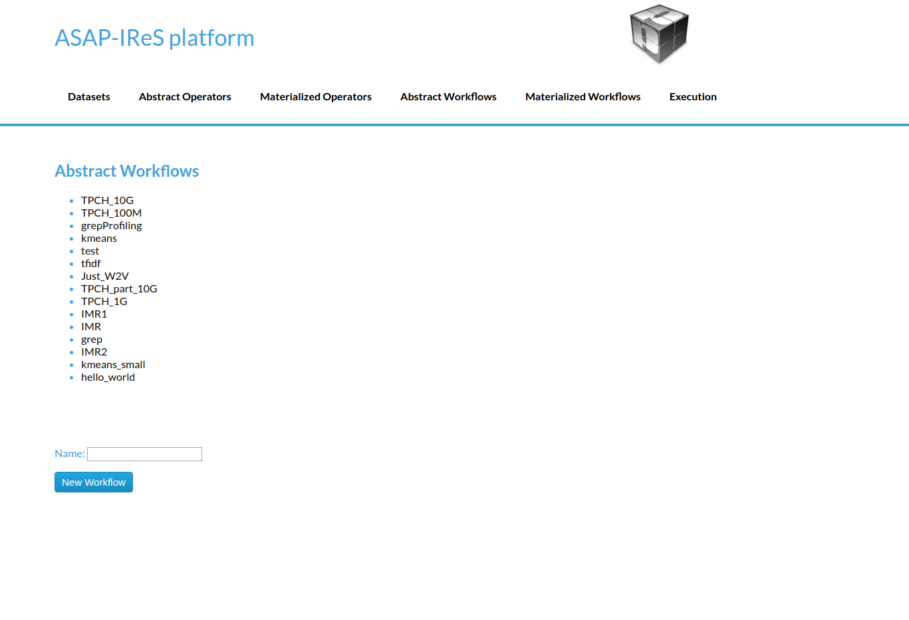
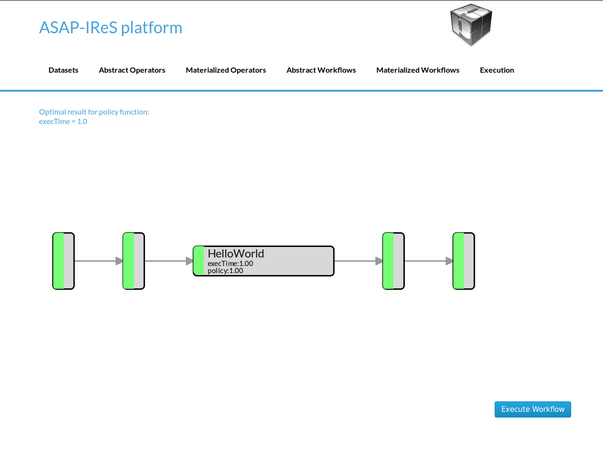
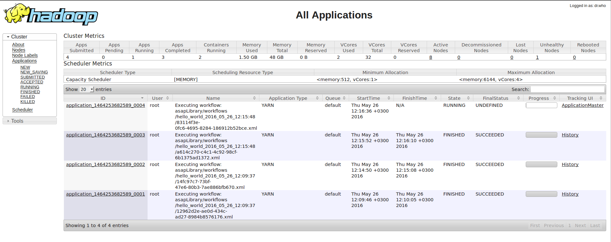
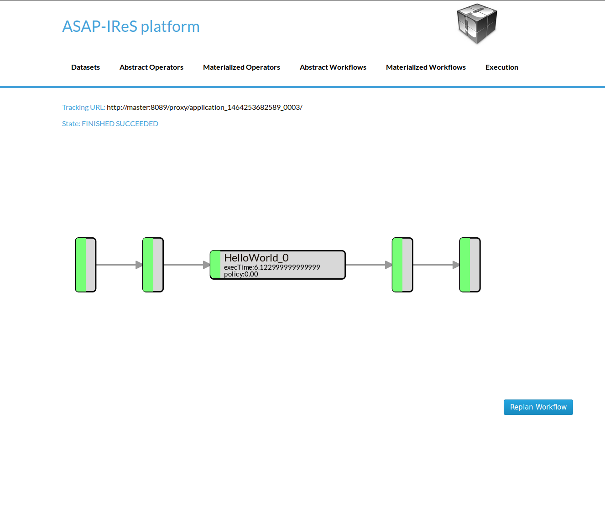
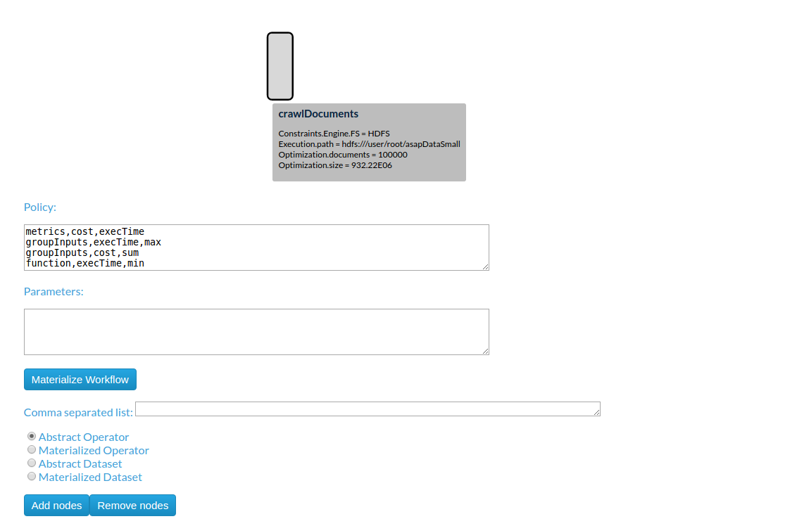
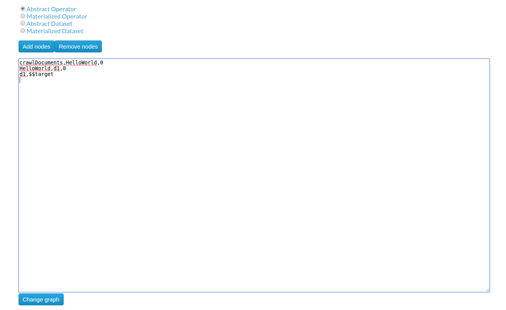
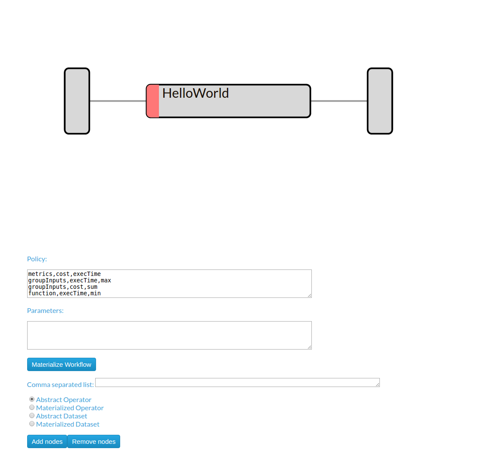
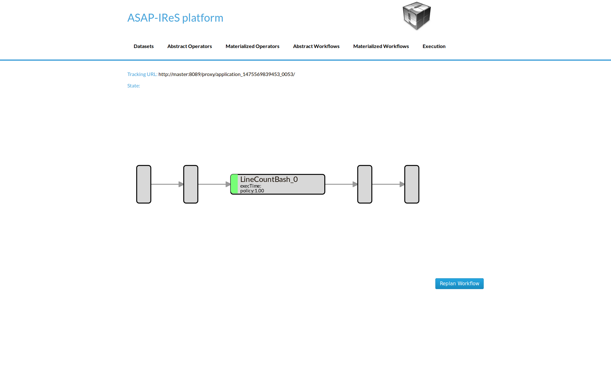

#########################
Installation & Deployment
#########################

========================
Installing IReS-Platform
========================

--------
Overview
--------
Installation of IRes-Platform requires 3 steps

----------------------------------
Clone IReS-Platform to the server 
----------------------------------

For a quick reference of how to use git, click `here <https://rogerdudler.github.io/git-guide/>`_.
Open a terminal (Linux) and navigate to a desired directory where IReS-Platform files will be cloned e.g. asap. Then, clone the project by entering the following command

.. code:: bash
	
	git clone git@github.com:project-asap/IReS-Platform.git

---------------
Run install.sh
---------------

After successful cloning of IReS-Platform inside the $IRES_HOME various folders and files can be found. Among them there exists install.sh.

You can run install.sh from any directory you would like. Here for demnostration reasons is assumed that the current working directory is $IRES_HOME. Executing,

.. code:: bash

	./install.sh

will start building IReS-Platform. Upon successful building you will be prompted to provide the path where Hadoop YARN is located in your computer. By doing this, IReS gets connected with Hadoop YARN. You can skip this step and the installation will be finished. 

NOTE: if you do not provide an existing YARN installation, then IReS will not be able to execute any workflow. Also, resources and cluster services monitoring will not be functioning.
you can provide YARN installation path afterwards as it will be shown straight ahead.
Connecting IReS to Hadoop YARN

Executing,

.. code:: bash
	
	./install.sh -c $YARN_HOME,$IRES_HOME

will make the connection of IReS and YARN, where $YARN_HOME and $IRES_HOME correspond to the absolute paths of YARN's and IReS's home folder.
Cluster Monitoring

This step requires the connection of IReS with YARN. Assuming that this connections has been established, then the user should update the file

$YARN_HOME/etc/hadoop/yarn-site.xml

and more specifically the values of the following properties,

.. code:: bash

	yarn.nodemanager.services-running.per-node
	yarn.nodemanager.services-running.check-availability
	yarn.nodemanager.services-running.check-status

These properties and some others have been added during the connection of IReS and YARN to enable IReS run workflows over YARN and cluster resources and services monitoring. Although details about filling these values are provided into $YARN_HOME/etc/hadoop/yarn-site.xml, roughly speaking, yarn.nodemanager.services-running.per-node property describes the cluster services running per node. The property, yarn.nodemanager.services-running.check-availability provides the commands per service that "tell" if the relative service runs or not. Finally, the property yarn.nodemanager.services-running.check-status has the statuses per service that the corresponding service has when it runs.

-----------------------
Validate installation
-----------------------

Here are some tips to confirm IReS installation.

If anything goes wrong during the build process of IReS, error messages will be print out and a log file will be provided.

----------------------
Start the IReS server
----------------------

Run IReS server by running the command

.. code:: bash

	./install.sh -r start

No exception should be raised. Also, the jps command should print a "Main" process running that corresponds to ASAP server.
Run ASAP server web user interface at http://your_hostname:1323/web/main. IReS home page should be displayed.
Run a workflow, for example run "hello_world" from "Abstrack Workflows" tab and see what happens not only in IReS web interface but also in YARN and HDFS web interfaces. Make sure that YARN has been started before running any workflow.
Click on "Cockpit" tab to verify that the expected services to run are really running.

================================
Running the HelloWorld workflow
================================

The HelloWorld is a simple workflow constists of just a single operator, designed for demonstration purposes. To run the HelloWolrd follow the next steps:

1. Go to IReS UI: http://ires_host:1323/web/main

.. figure:: ireshome.png
	
	IReS Home Page

2. Go to the **Abstract Workflows** tab and select the **HelloWorld** workflow

	
	Abstract Workflows Tab

3. Then click on **Materialize Workflow** button

.. figure:: abstracthello.png
	
	Abstract HelloWorld Workflow

4. Click on the **Execute Workflow** button to start the execution

	
	The materialized HelloWorld workflow

In the figures below we can see the execution process

.. figure:: exec1.png
   :width: 150%

   The execution has been started

   The submitted YARN application

   The execution has been finished

=================================================
Create the HelloWorld workflow from scratch (UI)
=================================================

In this section we describe the process of design a new workflow from scratch.

--------------------------------
1. Creating Abstract Operators
--------------------------------

In order to create a new workflow the definition of the abstract operators is needed. To define the **HelloWorld** abstract operator go to the **Abstract Operators** tab and enter the operator description in the text box. To create and save the new abstract operator click the "Add operator" button.

.. image:: newabstractoperator.png
   :width: 150%

-------------------------------------------------
2. Creating Materialized Operators (Server-side)
-------------------------------------------------

Currently, to add a materialized operator a folder with the least required files is needed. 

i. From the bash shell, go to the **asapLibrary/operators** folder in the IReS installation directory.

.. code:: bash

	cd $ASAP_HOME/target/asapLibrary/operators

ii. Then, create a new folder named with the new materialized operator's name. 

.. code:: bash

	mkdir HelloWorld

iii. Create the **description** file and enter the information below

.. code:: bash

	$ nano description

.. code:: javascript

	Constraints.Engine=Spark
	Constraints.Output.number=1
	Constraints.Input.number=1
	Constraints.OpSpecification.Algorithm.name=HelloWorld
	Optimization.model.execTime=gr.ntua.ece.cslab.panic.core.models.UserFunction
	Optimization.model.cost=gr.ntua.ece.cslab.panic.core.models.UserFunction
	Optimization.outputSpace.execTime=Double
	Optimization.outputSpace.cost=Double
	Optimization.cost=1.0
	Optimization.execTime=1.0
	Execution.Arguments.number=1
	Execution.Argument0=testout
	Execution.Output0.path=$HDFS_OP_DIR/testout
	Execution.copyFromLocal=testout

iv. Create the .lua file with the execution instructions

.. code:: bash

	$ nano HelloWorld.lua

.. code:: javascript

	operator = yarn {
	  name = "Execute Hello world",
	  timeout = 10000,
	  memory = 1024,
	  cores = 1,
	  container = {
	    instances = 1,
	    --env = base_env,
	    resources = {
	    ["HelloWorld.sh"] = {
	       file = "asapLibrary/operators/HelloWorld/HelloWorld.sh",
	                type = "file",               -- other value: 'archive'
	                visibility = "application"  -- other values: 'private', 'public'
	        }
	    },
	    command = {
	        base = "./HelloWorld.sh"
	    }
	  }
	}

v. Create the executable

.. code:: bash

	$ nano HelloWorld.sh

.. code:: javascript

	#!/bin/bash
	echo "Hello world" >> $1

vi. Restart the IReS server

.. code:: bash
	
	$ $IRES_HOME/asap-server/src/main/scripts/asap-server restart

------------------------------------------------------------------
3. Creating Materialized Operators (Client-side via the REST API)
------------------------------------------------------------------
As an alternative of section 2, a new materialized operator can be added using the provided REST API. This can be done by using the `addTarball` method of the `REST API <./rest_api>`_. The steps are similar with these of section 2.

i. Create a folder for the new operator (name does not matters)

.. code:: bash

	mkdir operator

ii. Navigate to the new folder

.. code:: bash

	cd operator

iii. Create the **description** file and enter the information below. By adding the new operator via `addTarball` method there is no need of creating a .lua file as it will be generated automatically. In such a case, three more parameters should be added in the `Execution` tree. These parameters are `cores`, `memory` and `command`.

.. code:: bash

	$ nano description

.. code:: javascript

	Constraints.Engine=Spark
	Constraints.Output.number=1
	Constraints.Input.number=1
	Constraints.OpSpecification.Algorithm.name=HelloWorld
	Optimization.model.execTime=gr.ntua.ece.cslab.panic.core.models.UserFunction
	Optimization.model.cost=gr.ntua.ece.cslab.panic.core.models.UserFunction
	Optimization.outputSpace.execTime=Double
	Optimization.outputSpace.cost=Double
	Optimization.cost=1.0
	Optimization.execTime=1.0
	Execution.Arguments.number=1
	Execution.Argument0=testout
	Execution.Output0.path=$HDFS_OP_DIR/testout
	Execution.copyFromLocal=testout
	####Extra Execution Parameters###
	Execution.cores=1
	Execution.memory=1024
	Execution.command=./HelloWorld.sh

iv. Put all files in the current directory in a compress (tar.gz) file:

.. code:: bash

	tar -cvf helloworld.tar.gz *

this command must be executed inside the operator's folder. The corresponding folder in IReS server will be created automatically.

v. Send the tarball via the REST API using curl:

.. code:: bash

	curl -H "Content-Type: application/octet-stream" -X POST --data-binary @helloworld.tar.gz ires_host:1323/operators/addTarball?opname=HelloWorld

The tarball for this example is available `here <./files/helloworld.tar.gz>`_.

-----------------------------------
4. Creating the Abstract Workflow
-----------------------------------

Now we will combine everything we created in the above steps to generate the new workflow. Go to the **Abstract Workflows** tab and click the "New Workflow" button.

.. image:: newworkflow1.png
   :width: 150%

Then we add the workflow parts one-by-one. First we add the **crawlDocuments** dataset from the dataset library. Select the **Materialized Dataset** radio button and enter the dataset name in the **Comma seperated list** text box. Then click the **Add nodes** button to add the dataset node to the workflow graph. Repeat this step to add an output node with name **d1**. Just enter the name **d1** to the text box and click the **Add nodes** button.

.. image:: newworkflow2.png
   :width: 150%

Add the **HelloWorld** abstract operator to the workflow. Select the **Abstract Operator** radio button, enter the operator's name (HelloWold) in the text box and click again the **Add nodes** button.

.. image:: newworkflow4.png
   :width: 150%

Describe the workflow by connecting the graph nodes defined in the previous steps as shown in the figure bellow and click the **Change graph** button.

In the figure bellow we can see the generated **Abstract Workflow**. Now click the **Materialize workflow**

The resulting materialized workflow

===============================================
Create an input-process-output workflow
===============================================
In this example we will create a workflow consists of a single operator which takes as input a text file and produces as output the number of lines.

-------------------
Dataset definition
-------------------
In order to create the workflow input dataset you need to add the dataset definition into IReS library. Create a file named 'asapServerLog' into the asapLibrary/datasets/ folder and add the following content:

.. code::
	
	Optimization.documents=1
	Execution.path=hdfs\:///user/root/asap-server.log
	Constraints.Engine.FS=HDFS

This step assumes that a file named 'asap-server.log' exists in the HDFS. You can download the log file used in this example `through this link <./files/asap-server.log>`_.

---------------------------------------------
Materialized Operator Definition (via REST)
---------------------------------------------
Create a folder locally and add the required `description` file as well as all other files needed for the exeuction. 

i. description file: Create inside the folder a file named `description` with the following content:

.. code:: javascript

	Constraints.Engine=Spark
	Constraints.Output.number=1
	Constraints.Input.number=1
	Constraints.OpSpecification.Algorithm.name=LineCount
	Optimization.model.execTime=gr.ntua.ece.cslab.panic.core.models.UserFunction
	Optimization.model.cost=gr.ntua.ece.cslab.panic.core.models.UserFunction
	Optimization.outputSpace.execTime=Double
	Optimization.outputSpace.cost=Double
	Optimization.cost=1.0
	Optimization.execTime=1.0
	Execution.Arguments.number=2
	Execution.Argument0=In0.path.local
	Execution.Argument1=lines.out
	Execution.Output0.path=$HDFS_OP_DIR/lines.out
	Execution.copyFromLocal=lines.out
	Execution.copyToLocal=In0.path
	Execution.command=./count_lines.sh

ii. executable file: Create the executable named 'count_lines.sh' with the following content:

.. code:: bash
	
	#!/bin/bash
	wc -l $1 >> $2

and make it executable

.. code:: bash
	
	chmod +x count_lines.sh

iii. Send the operator via the 'send_operator.sh' script:

.. code:: bash
	
	./send_operator.sh LOCAL_OP_FOLDER IRES_HOST LineCount

The script is available at $IRES_HOME/asap-server/src/main/scripts. You can also `download it directly <https://github.com/project-asap/IReS-Platform/blob/master/asap-platform/asap-server/src/main/scripts/send_operator.sh>`_.

------------------------------
Abstract operator definition
------------------------------
Create the `LineCount` abstract operator by creating a file named 'LineCount' in the asapLibrary/abstractOperators folder with the following content:

.. code:: javascript

	Constraints.Output.number=1
	Constraints.Input.number=1
	Constraints.OpSpecification.Algorithm.name=LineCount

--------------------------------
Abstract workflow definition
--------------------------------
Create the `LineCountWorkflow` workflow by creating a folder named 'LineCountWorkflow' in the asapLibrary/abstractWorkflows. The abstract workflow folder should consist of three required components: the `datasets` folder , the `operators` folder and a file named `graph`.

i. datasets: Create a folder named 'datasets' and copy the `asapServerLog` file from the `asapLibrary/datasets/` folder into it. Then, create an empty file named 'd1' (touch d1). 

ii. graph: Create a file named 'graph' and add the following content:

.. code:: javascript

	asapServerLog,LineCount
	LineCount,d1
	d1,$$target

This `graph` file defines the workflow graph as follows: `asapServerLog` dataset is being given as input to the `LineCount` abstract operator and `LineCount` operator outputs the result into `d1`. Finally, `d1` node maps to the final result ($$target).

iii. operators: Create a folder named 'operators' which will contain the operators involved in the worflow. In the 'operators' folder create a file named 'LineCount' and add the following content:

.. code:: javascript

	Constraints.Engine=Spark
	Constraints.Output.number=1
	Constraints.Input.number=1
	Constraints.OpSpecification.Algorithm.name=LineCount

Restart the server for changes to take effect.

.. code:: bash

	$IRES_HOME/asap-platform/asap-server/src/main/scripts/asap-server restart

-------------------------
Workflow Materialization
-------------------------
To materialize the workflow navigate to the `Abstract Workflows` tab and click on the LineCountWorkflow created in the previous steps. 

.. image:: ./images/lineCount/abstractLineCount.png
   :width: 150%

Click on the `Materialize Workflow` button

.. image:: ./images/lineCount/lineCountMaterialized.png
   :width: 150%

Now you can see the materialized LineCount workflow. Click on `Execute Workflow` button to trigger the execution

When the execution finish, navigate to the HDFS file browser to see the output located at appN folder.

.. image:: ./images/lineCount/lineCountHDFS.png
   :width: 150%

All resources and examples files described in this section are available `here <./files/LineCountExample.tar>`_.